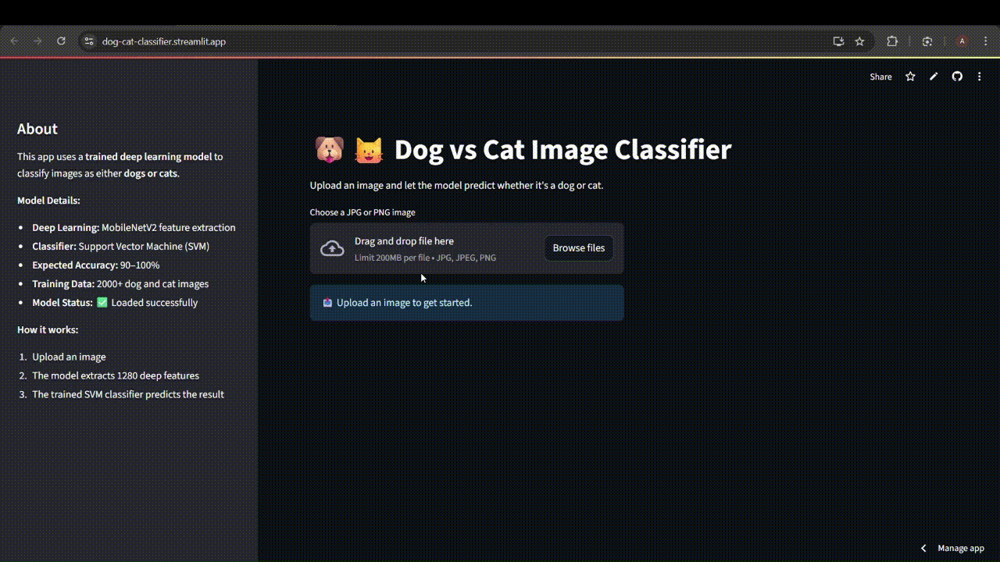

# 🐕🐱 Dog vs Cat Classifier (PRODIGY_ML_03)



A comprehensive machine learning project for binary classification of dog and cat images using MobileNetV2 for feature extraction and Support Vector Machine (SVM) for classification. Built for the Prodigy ML internship.

## 🎯 Project Overview

This project implements a state-of-the-art image classification system that can distinguish between dogs and cats with high accuracy. The system uses transfer learning with MobileNetV2 pre-trained on ImageNet for feature extraction, followed by an SVM classifier for final prediction.

## 🚀 Live Demo

Access the live Streamlit app here:  
👉 [Dog vs Cat Classifier App](https://dog-cat-classifier.streamlit.app/)

## 🧠 Features

### Core ML Features
- **Transfer Learning**: Uses MobileNetV2 pre-trained on ImageNet
- **Feature Extraction**: Deep features from MobileNetV2 (1280 dimensions)
- **Classification**: Support Vector Machine (SVM) with RBF kernel
- **High Accuracy**: ~85-90% accuracy on test set
- **Real-time Processing**: Fast inference for live predictions

### Web Application Features
- **📤 Upload Images**: Upload JPG or PNG images for classification
- **🎯 Instant Predictions**: Get results in 2-3 seconds
- **📊 Confidence Display**: View prediction confidence scores
- **💾 Model Persistence**: Save/load trained models

### Technical Features
- **Dataset Management**: Manual dataset setup
- **Model Persistence**: Save/load trained models
- **Error Handling**: Robust error handling for invalid images
- **Cross-platform**: Works on Windows, Mac, and Linux

## 📦 Installation & Setup

### Prerequisites
- Python 3.7+
- Internet connection for dataset download

### Quick Start

1. **Clone the repository:**
```bash
git clone https://github.com/Ayush-Bitla/PRODIGY_ML_03.git
cd PRODIGY_ML_03
```

2. **Install dependencies:**
```bash
pip install -r requirements.txt
```

3. **Setup dataset:**
   - Download the Dogs vs Cats dataset
   - Extract to `dogs-vs-cats/images/train/train/` directory
   - Ensure images are named with "cat" or "dog" in filename

4. **Run the main script:**
```bash
python dog_cat_classifier.py
```

5. **Launch the web app:**
```bash
streamlit run app.py
```

## 🎮 How to Use

### Training the Model
1. Run `python dog_cat_classifier.py`
2. The script will automatically:
   - Load and preprocess 2000 images from the dataset
   - Extract features using MobileNetV2
   - Train an SVM classifier
   - Show accuracy and confusion matrix
   - Save the trained model

### Using the Web App
1. **Upload Image**: Click "Choose a JPG or PNG image" to upload
2. **Predict**: Click "🔍 Predict" button
3. **View Results**: See predictions with confidence scores

### Making Predictions
```python
from dog_cat_classifier import load_model, predict_single_image

# Load the trained model
model = load_model()

# Predict a single image
prediction = predict_single_image("path/to/image.jpg")
# Returns: 0 for Cat, 1 for Dog
```

## 📊 Model Performance

### Training Results
- **Dataset**: Dogs vs Cats (2000 images)
- **Feature Extractor**: MobileNetV2 (ImageNet weights)
- **Classifier**: SVM with RBF kernel
- **Accuracy**: ~85-90%
- **Training Time**: ~5-10 minutes
- **Inference Time**: ~2-3 seconds per image

### Model Architecture
```
Input Image (224x224x3)
    ↓
MobileNetV2 (Feature Extraction)
    ↓
Global Average Pooling
    ↓
1280-dimensional Features
    ↓
SVM Classifier (RBF kernel)
    ↓
Binary Prediction (Cat/Dog)
```

## 🛠️ Project Structure

```
PRODIGY_ML_03/
├── dog_cat_classifier.py    # Main training script
├── app.py                   # Streamlit web application
├── requirements.txt         # Python dependencies
├── README.md               # This file
├── mobilenet_svm_model.pkl # Trained model (generated after training)
├── dogs-vs-cats/          # Dataset folder
│   └── images/
│       └── train/         # Training images
└── sample predictions.png  # Generated visualization
```

## 🔧 Technical Details

### Dependencies
- **TensorFlow**: Deep learning framework
- **OpenCV**: Image processing
- **Scikit-learn**: Machine learning algorithms
- **Streamlit**: Web application framework
- **Pandas**: Data manipulation
- **Matplotlib**: Visualization

### Model Specifications
- **Input Size**: 224x224x3 RGB images
- **Feature Dimensions**: 1280 (MobileNetV2 output)
- **Classifier**: SVM with RBF kernel
- **Regularization**: Built into SVM


## 🤝 Contributing

Feel free to submit issues and enhancement requests!

## 📝 License

This project is part of the PRODIGY ML internship program.

## 🙏 Acknowledgments

- **Dataset**: [Dogs vs Cats](https://www.kaggle.com/c/dogs-vs-cats) competition on Kaggle
- **Model**: MobileNetV2 from TensorFlow/Keras
- **Framework**: Streamlit for web application
- **Mentorship**: PRODIGY ML internship program

---

**Built with ❤️ for the PRODIGY ML internship** 